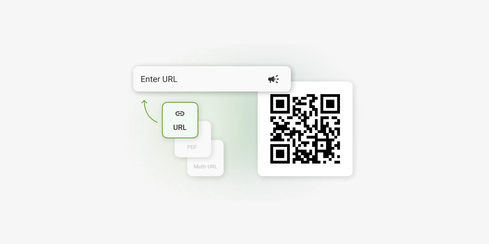

# 🔍 Offline QR Code Generator

A simple, fast, and fully offline QR code generator that runs directly in your browser. No internet connection required, made by Axxo Labs

## 🚀 Features
* *100% Offline:* Works without an internet connection.
* *Instant Generation:* QR codes are generated as you type.
* *Customizable:* Change colors and sizes easily.
* *Privacy Focused:* Your data stays on your machine.

## 🛠️ How to Use
1. Clone the repository or download the ZIP.
2. Open `index.html` in any modern web browser.
3. Type your text/URL and download your QR code.

## 📂 Project Structure
* `index.html` - The main interface.
* `style.css` - Custom styling for the generator.
* `script.js` - Logic for generating the QR codes.